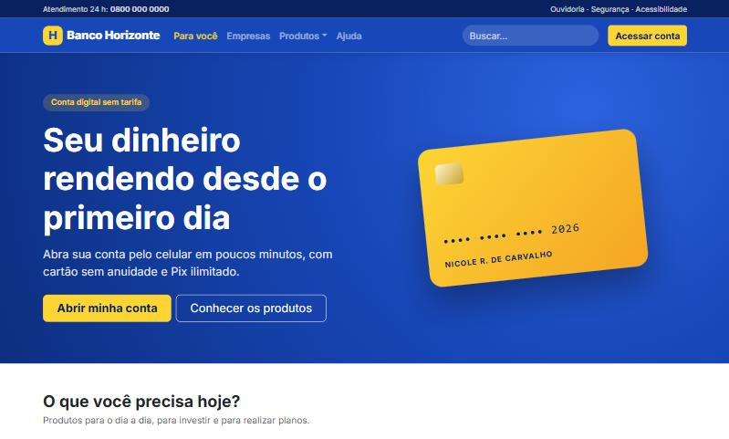
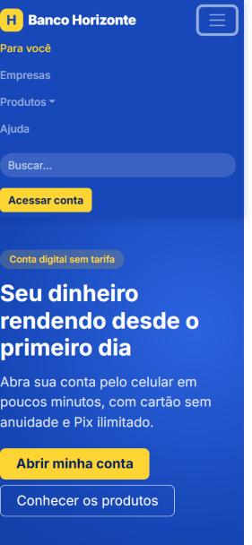

# 🏦 Banco Horizonte: página inicial com Bootstrap

Página inicial de um **banco fictício**, feita com **HTML, CSS e Bootstrap 5**. O destaque é a **barra de navegação responsiva**, que vira um menu recolhível no celular, com menu suspenso, busca e botão de acesso à conta.

  

## ✨ O que tem

- 🧭 **Navbar responsiva** com menu suspenso de produtos, campo de busca e botão "Acessar conta"
- 📱 **Menu recolhível** no celular (botão hambúrguer do Bootstrap)
- 💳 **Destaque principal** com chamada para abrir conta e um cartão desenhado só com CSS
- 🧩 **Cartões de serviços** (Pix, cartões, investimentos e financiamentos) em grid responsivo
- ♿ **Acessibilidade:** link "Pular para o conteúdo", rótulo no campo de busca, `aria-label` no botão do menu e foco visível

  

## 🧠 Decisões técnicas

- **Bootstrap para a estrutura, CSS próprio para a identidade:** o grid, a navbar e o dropdown vêm do Bootstrap; cores, tipografia e componentes como o cartão de crédito ficam em [`css/style.css`](css/style.css), com as cores em variáveis CSS.
- **Cartão de crédito sem imagem:** feito com `aspect-ratio`, gradientes e `transform`, então é leve e nítido em qualquer tela.
- **Banco fictício:** o projeto começou inspirado no Banco do Brasil, mas usa uma marca inventada para não reproduzir a identidade de uma empresa real.

## 🛠️ Tecnologias

HTML · CSS · Bootstrap 5.3

## 🚀 Como executar

Baixe o repositório e abra o `index.html` no navegador. Para ver o menu do celular, deixe a janela estreita.
